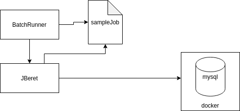
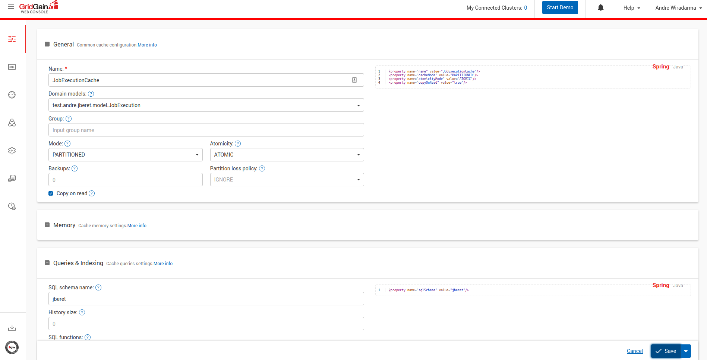
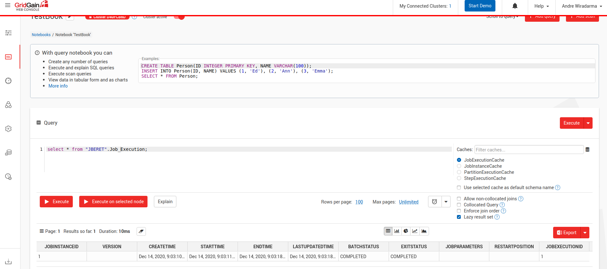
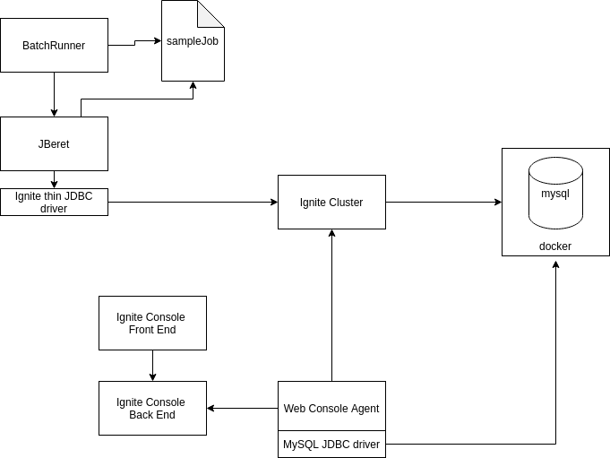
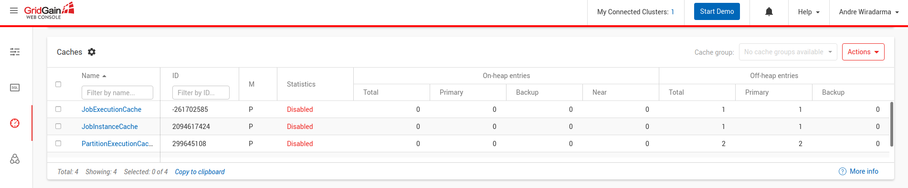

## Exploring Apache Ignite / Gridgain IMDG as a write-through cache

### Use jberet with a mysql backend

- Start mysql database
- Configure jberet.properties in the [batch-runner](https://github.com/awiradarma/batch-runner) repo to use mysql 
- Run the sample batch job
```
java -cp ./target/batch-runner-1.0-SNAPSHOT.jar:../jberet-distribution-1.4.0.Final/lib/*:./target/libs/* test.andre.BatchRunner sampleJob
```
- Make sure the tables are created
```
mysql> show tables;
+---------------------+
| Tables_in_jberet    |
+---------------------+
| JOB_EXECUTION       |
| JOB_INSTANCE        |
| PARTITION_EXECUTION |
| STEP_EXECUTION      |
+---------------------+
4 rows in set (0.00 sec)

mysql> 
```

### Use Gridgain web console to create a mapping of the jberet database schema 
```
mkdir /tmp/gridgain
mkdir /tmp/gridgain/work
chmod 777 /tmp/gridgain
chmod 777 /tmp/gridgain/work
docker run -d -it --name console_backend  -v /tmp/gridgain/work:/opt/gridgain-web-console-server/work gridgain/gridgain-web-console-backend
docker run -d --name=console_frontend -p 9080:8008/tcp --link console_backend:backend gridgain/gridgain-web-console-frontend
./web-console-agent.sh 
```
- Use the configuration tab to create a new cluster configuration and import from database

- Change all the generated caches to use the same schema name (e.g. jberet)



### Modify the generated [java project](https://github.com/awiradarma/gridgain/tree/main/JBeretCluster)
- Create [custom SQL function](https://github.com/awiradarma/gridgain/blob/main/JBeretCluster/src/main/java/config/SQLFunction.java) to generate sequence number and [initialized after the caches are loaded](https://github.com/awiradarma/gridgain/blob/main/JBeretCluster/src/main/java/startup/ServerNodeCodeStartup.java#L30)
- Modify the jberet's [JDBC repository](https://github.com/awiradarma/jsr352/blob/apache_ignite_write_through/jberet-core/src/main/java/org/jberet/repository/JdbcRepository.java#L316) and [SQL statements](https://github.com/awiradarma/jsr352/blob/apache_ignite_write_through/jberet-core/src/main/resources/sql/jberet-sql.properties#L5) to leverage Ignite's AtomicSequenceNumber via custom SQL function

### Start the Ignite cluster and load the cache
```
java -cp ./target/JberetCluster-project-8.7.9.jar:./target/libs/* startup.ServerNodeCodeStartup 
```
- You should be able to quary the table using the web console as well


### Make changes to the jberet.properties in the batch-runner repo and rerun the sample batch job
```
java -cp ./target/batch-runner-1.0-SNAPSHOT.jar:../jberet-distribution-1.4.0.Final/lib/*:./target/libs/* test.andre.BatchRunner sampleJob
```

### Final set up



### Number of cache entries can also be monitored via web console
